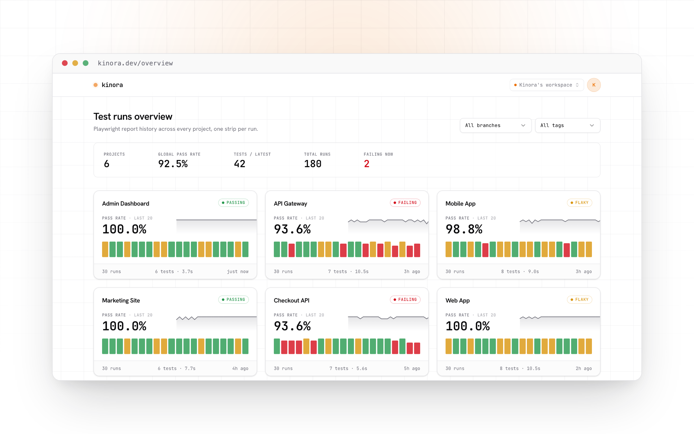

<p align="center">
  
</p>

<h1 align="center">kinora</h1>

<p align="center">
  A dashboard for your Playwright tests, across projects and over time.<br>
  With the full Playwright trace viewer built in.
</p>

<p align="center">
  <a href="https://kinora.dev">Website</a> ·
  <a href="https://demo.kinora.dev">Live demo</a> ·
  <a href="https://docs.kinora.dev">Docs</a> ·
  <a href="https://kinora.dev/trace">Open a trace</a> ·
  <a href="https://app.kinora.dev">Cloud</a>
</p>

<p align="center">
  <a href="https://github.com/Kinora-dev/kinora/releases/latest"></a>
  <a href="LICENSE"></a>
  
</p>

---

<p align="center">
  <picture>
    <source media="(prefers-color-scheme: dark)" srcset=".github/assets/readme-hero-dark.png">
    <source media="(prefers-color-scheme: light)" srcset=".github/assets/readme-hero-light.png">
    
  </picture>
</p>

Playwright ships a great HTML report for a single run. kinora sits one level up: push every CI run to a kinora server and get one place to track pass rates, spot trends, and surface flaky tests over time. Failing tests get a **View trace** button that opens the full Playwright trace (DOM, timeline, network, console) right in the dashboard.

## Send your tests

Add the reporter to your Playwright config, it uploads at the end of every run:

```ts
// playwright.config.ts
export default defineConfig({
  reporter: [['@kinora/reporter', { project: { slug: 'web-app' } }]],
  // enable tracing so View trace works
  use: { trace: 'on-first-retry' },
})
```

```bash
KINORA_TOKEN=<token> npx playwright test
```

Git and CI metadata are filled in automatically on GitHub Actions. No reporter? [`@kinora/cli`](packages/cli) uploads an existing `results.json` and can bulk-import a backlog of past reports. Self-hosting? Point either one at your server with `KINORA_URL`.

## Desktop app

[Download](https://github.com/Kinora-dev/kinora/releases/latest) for macOS, Windows or Linux. It signs into your account and opens on the latest run's failures, re-runs a failing test locally, and opens any local `trace.zip` without an account, a self-contained replacement for `playwright show-trace`.

## Debug from your agent

Point a coding agent at your kinora data with [`@kinora/mcp`](packages/mcp): it serves the last run's failures (error, `file:line`, trace) plus per-test history, so the agent can go straight to the fix.

## Self-hosting

One `docker compose` brings up the whole stack (Postgres + server + dashboard, single origin, local-FS artifacts). See [`selfhost/README.md`](selfhost/README.md).

## Development

```bash
pnpm install

# 1. server + database
cd packages/server
cp .env.example .env
docker compose up -d            # Postgres on :5436
pnpm migrate latest             # create tables
pnpm db:seed                    # seed a demo account + data, prints login + an API token
pnpm dev                        # server on :3000

# 2. web
cd packages/web
cp .env.example .env
pnpm dev                        # dashboard on :5173

# 3. trace viewer (from the repo root)
pnpm dev:viewer                 # trace viewer on :5174
```

Open http://localhost:5173 and sign in with the seeded credentials (`demo@kinora.dev` / `password123`). See [CONTRIBUTING.md](CONTRIBUTING.md) to go further.

## License

Fair source. The deployable product (`server`, `web`, `desktop`) is [FSL-1.1-MIT](LICENSE), the client libraries you embed (`reporter`, `cli`, `mcp`, `core`, `ui`) and the trace viewer are MIT. The trace engine under `packages/trace-viewer/src/core` and `src/sw` is vendored from [microsoft/playwright](https://github.com/microsoft/playwright) (Apache-2.0).
